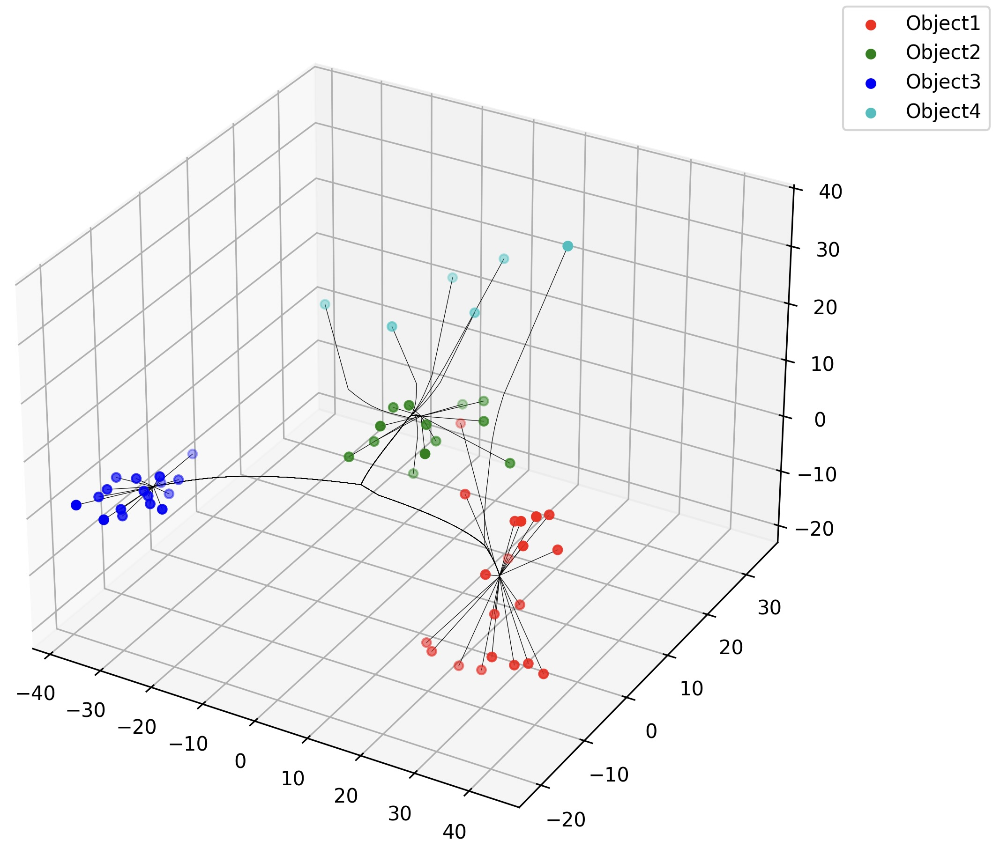
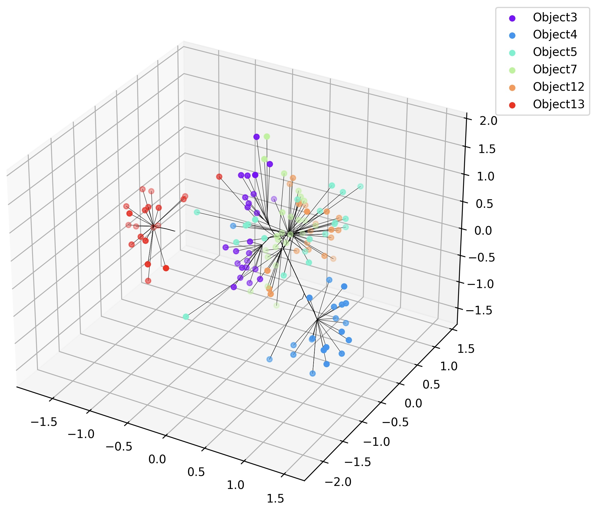
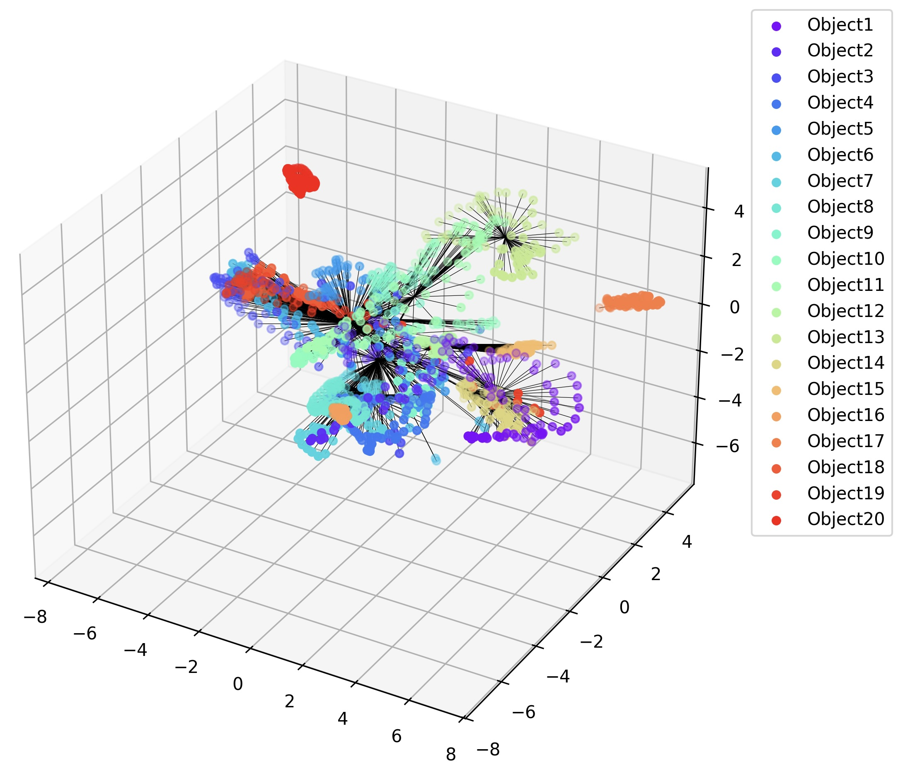

# Convex Clustering

## 1. Introduction
Clustering is a fundamental problem in science and engineering.
This is a convex clustering implementation on PyTorch, aiming to solve large-scale convex clustering problems with GPU acceleration.
Our solver provides several convex clustering methods, including:

* Semismooth Newton-CG Augmented Lagrangian Method (SSNAL) [[1]](#ref1) [[2]](#ref2)
* Alternating Direction Method of Multipliers (ADMM) [[3]](#ref3)
* Alternating Minimization Algorithm (AMA) and Fast AMA [[3]](#ref3)
* Primal-Dual Hybrid Gradient Algorithm (PDHG)

Our solver also visualizes the clustering path results:

<div style="display: flex; justify-content: space-around;">
    <figure style="margin: 10px;">
        
        <figcaption>LUNG dataset</figcaption>
    </figure>
    <figure style="margin: 10px;">
        
        <figcaption>LIBRAS6 dataset</figcaption>
    </figure>
    <figure style="margin: 10px;">
        
        <figcaption>COIL20 dataset</figcaption>
    </figure>
</div>

[//]: # (LUNG dataset &#40;left&#41; and LIBRAS6 dataset &#40;right&#41; are shown as examples.)

## 2. Hardware and software
### 2.1. Hardware
* CPU: Intel(R) Xeon(R) Platinum 8480C
* GPU: NVIDIA GeForce RTX 4090
### 2.2 Software
* Ubuntu 22.04
* Python 3.10.14
* Pytorch 2.2.2
* CUDA 12.1


## 3. File Structure
* `/convex_cluster_solver`: Convex clustering solver
  * `/solvers`: Convex clustering solver in different methods
    * `__init__.py`: Initialization file'
    * `base.py`: Base class of convex clustering solver
    * `ama.py`: AMA method and Fast AMA method
    * `admm.py`: ADMM method
    * `pdhg.py`: PDHG method
    * `ssnal.py`: SSNAL method
  * `__init__.py`: Initialization file
  * `data_processor.py`: Data preprocessing, including weight vector and matrix calculation, data mapping, etc.
  * `factory.py`: Factory class for convex clustering solver`
  * `global_variable.py`: Global variables, including log file setting, the arguments from the command line, etc.

[//]: # (  * `find_cluster.py`: Find the cluster of the data)
  * `utils.py`: Utility functions, including Projects, Proximal operators, conjugate gradient(CG) and PCG method, etc.
* `/data`: Real datasets
* `/IChol_CUDA`: Incomplete Cholesky Decomposition with CUDA Extension
* `demo.py`: Main file
* `demo.ipynb`: Jupyter notebook demo.


## 4. Related Packages
You need to install the following packages before running the code.
### 4.1. KNN_CUDA
This package is used to calculate the K-nearest neighbors (KNN) on GPU.
```commandline
$  pip install --upgrade https://github.com/unlimblue/KNN_CUDA/releases/download/0.2/KNN_CUDA-0.2-py3-none-any.whl
```
And then, make sure _ninja_ has been installed:
```commandline
$  wget -P /usr/bin https://github.com/unlimblue/KNN_CUDA/raw/master/ninja
```
Reference: https://github.com/unlimblue/KNN_CUDA

### 4.2. cholespy
This package is used to calculate the Cholesky decomposition for sparse matrix on both CPU and GPU.
```commandline
$  pip install cholespy
```
Reference: https://github.com/rgl-epfl/cholespy

### 4.3. Incomplete Cholesky Decomposition with CUDA Extension
For PCG method, we implement the PyTorch extension with CUDA.
```commandline
$  python IChol_CUDA/setup.py install
```
Note that you need to keep your Torch version consistent with the CUDA version.
Else, it would raise an error in the compilation process.


## 5. Usage
**For detailed instructions, please refer to the demo file `main.py` or `demo.ipynb`.**

You can also use the following command to run the code.
commandline
### 5.1 AMA method
```commandline
$  python main.py --solver=ama --use_kkt=False --k_neighbor=10 --stoptol=1e-6 --maxiter=20000
```

### 5.2 Fast AMA method
```commandline
$  python main.py --solver=fast_ama --use_kkt=False --k_neighbor=10 --stoptol=1e-6 --maxiter=20000
```

### 5.3 ADMM method
```commandline
$  python main.py --solver=admm --admm_sub_method='cholesky' --sigma=1 --use_kkt=False --k_neighbor=10 --stoptol=1e-6 --maxiter=20000 
```
admm_sub_method: 'cholesky' or 'cg'
sigma: the parameter init sigma value of ADMM

### 5.4 PDHG method
```commandline
$  python main.py --solver=pdhg --use_kkt=False --k_neighbor=10 --stoptol=1e-6 --maxiter=20000
```


## 6. Reference

<a id="ref1"></a>[1] D.F. Sun, K.C. Toh, and Y.C. Yuan, Convex clustering: model, theoretical guarantee and efficient algorithm, Journal of Machine Learning Research, 22(9), 2021.

<a id="ref2"></a>[2] Y.C. Yuan, D.F. Sun, and K.C. Toh, An efficient semismooth Newton based algorithm for convex clustering, ICML 2018.

<a id="ref3"></a>[3] Chi E C, Lange K. Splitting methods for convex clustering[J]. Journal of Computational and Graphical Statistics, 2015, 24(4): 994-1013.
