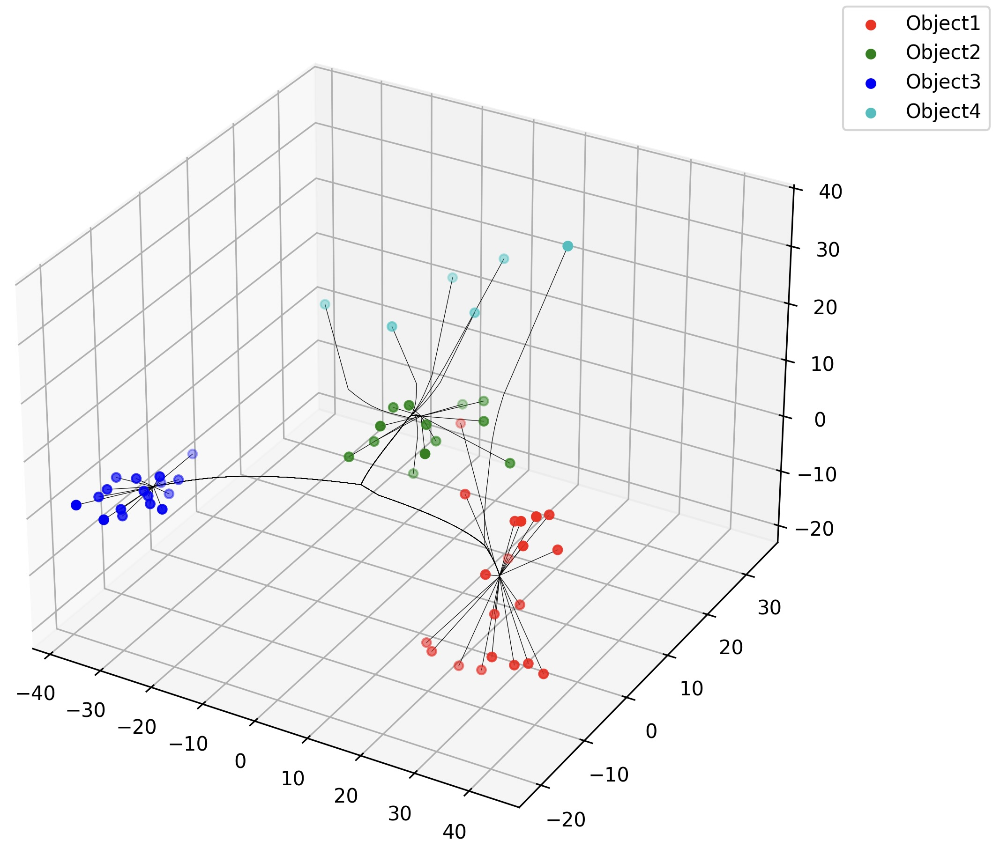
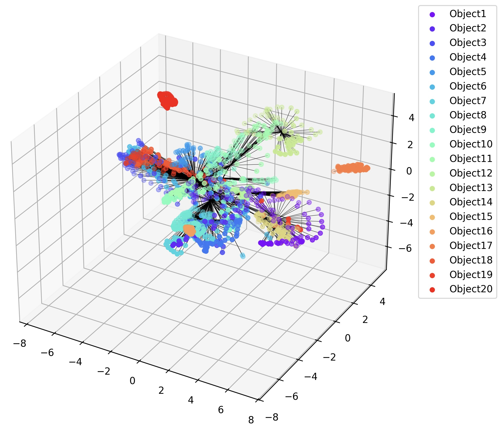
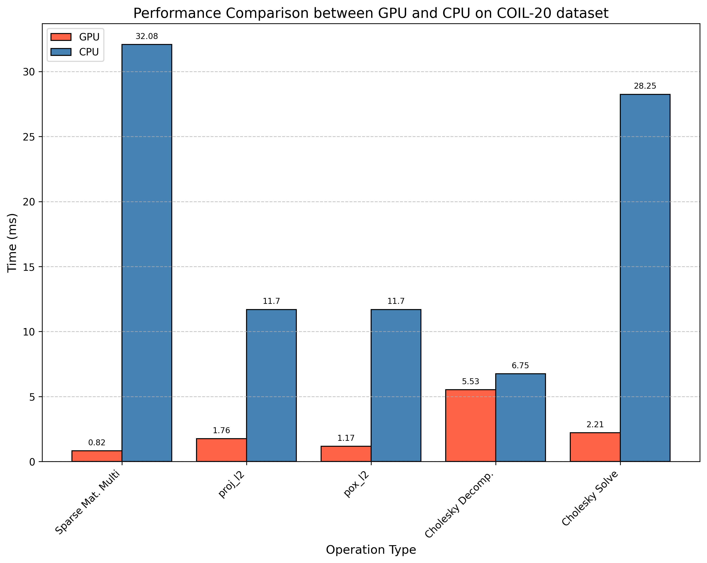
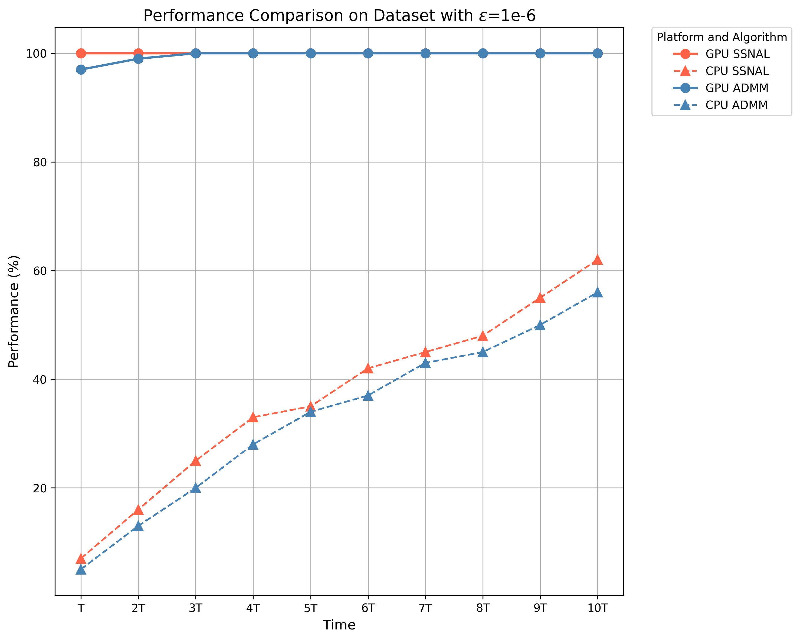

# PyClustrPath : Efficient convex clustering solver with GPU acceleration

## 1. Introduction
Convex clustering is a popular clustering model without requiring the number of clusters as prior knowledge. 
PyClustrPath is a convex clustering implementation on PyTorch, aiming to solve large-scale convex clustering problems with GPU acceleration.
Our solver provides several convex clustering methods, including:

* Semismooth Newton-CG Augmented Lagrangian Method (SSNAL) [[1]](#ref1) [[2]](#ref2)
* Alternating Minimization Algorithm (AMA) and Fast AMA [[3]](#ref3)
* Alternating Direction Method of Multipliers (ADMM) [[3]](#ref3)

[//]: # (* Primal-Dual Hybrid Gradient Algorithm &#40;PDHG&#41;)

Our solver also visualizes the clustering path results:

<table>
    <tr>
        <td align="center">
            <br/>
            <b>LUNG dataset</b>
        </td>
        <td align="center">
            <br/>
            <b>LIBRAS-6 dataset</b>
        </td>
        <td align="center">
            <br/>
            <b>COIL-20 dataset</b>
        </td>
    </tr>
</table>


The following figures show the performance comparison between GPU and CPU on the COIL-20 dataset.
The first figure demonstrates the GPU's superior performance for various tensor operations. 
For example, on the COIL-20 dataset (with dimensions 1024*1440), the speedup for sparse matrix multiplication and Cholesky decomposition 
for solving systems of linear equations is approximately 40 times and 12 times, respectively.
The other figure shows that when solving 100 problems, the CPU can only solve less than 65% of the problems within 10 times the time of the GPU. 
The overall GPU speedup exceeds tenfold.

<table>
    <tr>
        <td align="center">
            <br/>
            <b>Operation performance on GPU and CPU</b>
        </td>
        <td align="center">
            <br/>
            <b>Profile of different Algorithms and Platforms</b>
        </td>
    </tr>
</table>


## 2. Hardware and Environment
### 2.1. Hardware
* CPU: Intel(R) Xeon(R) Platinum 8480C
* GPU: NVIDIA GeForce RTX 4090
### 2.2 Environment
* Ubuntu 22.04
* CUDA 12.1
* Python 3.10.14
* Pytorch 2.2.2


## 3. File Structure
* `/pyclustrpath`: Convex clustering solver
  * `/solvers`: Convex clustering solver in different methods
    * `__init__.py`: Initialization file'
    * `base.py`: Base class of convex clustering solver
    * `ama.py`: AMA method and Fast AMA method
    * `admm.py`: ADMM method
    * `pdhg.py`: PDHG method
    * `ssnal.py`: SSNAL method
    * `ssncg.py`: SSNCG method in SSNAL
  * `__init__.py`: Initialization file
  * `data_processor.py`: Data preprocessing, including weight vector and matrix calculation, data mapping, etc.
  * `global_variable.py`: Global variables, including log file setting, the arguments from the command line, etc.
  * `utils.py`: Utility functions, including Projects, Proximal operators,Incomplete Cholesky Decomposition
  * `visualize.py`: Visualization functions, including the clustering path visualization
  * `/IChol_CUDA`: Incomplete Cholesky Decomposition with CUDA Extension


  

* `/demo`: Demo files
  * `/data/real_data`: Real datasets
  * `/results`: Clustering path visualization and the comparison between GPU and CPU
    * `/cluster_path_pictures`: Clustering path visualization results
  * `demo_lung.py`: Demo file for the LUNG dataset
  * `demo_libras6.py`: Demo file for the LIBRAS-6 dataset
  * `demo_libras.py`: Demo file for the LIBRAS dataset
  * `demo_COIL20.py`: Demo file for the COIL20 dataset
  * `demo_MNIST.py`: Demo file for the MNIST dataset


## 4. Related Packages
**Note on PyTorch Installation** :
PyClustrPath depends on [_`PyTorch `_](https://pytorch.org/get-started/locally/). Please install it from the above link.
You also need to install the following packages before running the code.
### 4.1. KNN_CUDA
This package is used to calculate the K-nearest neighbors (KNN) on GPU.
```commandline
$  pip install --upgrade https://github.com/unlimblue/KNN_CUDA/releases/download/0.2/KNN_CUDA-0.2-py3-none-any.whl
```
And then, make sure _ninja_ has been installed:
```commandline
$  wget -P /usr/bin https://github.com/unlimblue/KNN_CUDA/raw/master/ninja
```
Reference: https://github.com/unlimblue/KNN_CUDA

### 4.2. cholespy
This package is used to calculate the Cholesky decomposition for sparse matrix on both CPU and GPU.
```commandline
$  pip install cholespy
```
Reference: https://github.com/rgl-epfl/cholespy

### 4.3. Incomplete Cholesky Decomposition with CUDA Extension
For PCG method, we implement the PyTorch extension with CUDA for the incomplete Cholesky decomposition.
```commandline
$  python IChol_CUDA/setup.py install
```
Note that you need to keep your Torch version consistent with the CUDA version.
Else, it would raise an error in the compilation process.


## 5. Usage
For detailed instructions, please refer to the files in the `/demo` folder. The following is an example of running the code on the LUNG dataset using the SSNAL method.


### 5.1 Parameter setting
In the function `get_args()`, you can set the parameters by change the _**default**_ values,
including the solver algorithm, stopping tolerance, maximum number of iterations, number of neighbors, and whether to use the KKT condition to stop the solver.
```python
import numpy as np
import torch
import argparse
import scipy.io as sio

from pyclustrpath.utils import str2bool
from pyclustrpath import gv, visualize_clustering_results

device = 'cuda' if torch.cuda.is_available() else 'cpu'                        # Set the device

def get_args():
    # define the argument parser
    parser = argparse.ArgumentParser()
    parser.add_argument('--solver', default='ssnal', type=str, choices=['admm', 'ama', 'fast_ama', 'ssnal', 'pdhg'],
                        help='The solver to use: admm, fast_ama, ssnal, or pdhg')
    parser.add_argument('--stop_tol', default=1e-6, type=float, help='Stopping tolerance for the solver')
    parser.add_argument('--max_iter', default=20000, type=int, help='Maximum number of iterations for the solver')
    parser.add_argument('--k_neighbor', default=10, type=int, help='Number of neighbors to consider in the data processor')
    parser.add_argument('--use_kkt', default=False, type=str2bool, help='Whether to use the KKT condition to stop the solver')

    parser.add_argument('--data', default='libras', type=str,
                        help='The dataset to use: libras6, libras, COIL20, lung, MNIST_test')
    parser.add_argument('--device', default=device, type=str, help='The device to use: cpu or cuda')

    return parser.parse_args()    
```

### 5.2 Main function
```python
def main():
    # get the arguments
    args = get_args()
    gv._init(args)

    data = sio.loadmat('data/real_data/lung.mat')                                       # Load the LUNG data
    tensor_data = torch.Tensor(data['X']).double()
    data_label = np.squeeze(data['col_assign'])

    gamma_upper = 0.93                                                                  # Set the list of gamma
    gamma_lower = 0.057
    gamma_num = 100
    gamma_step = (gamma_upper - gamma_lower) / (gamma_num - 1)
    gamma_list = np.arange(gamma_upper, gamma_lower - gamma_step, -gamma_step)

    from pyclustrpath import DataProcessor
    data_processor = DataProcessor(X=tensor_data, k=args.k_neighbor, device=device)     # Process the data

    from pyclustrpath import ConvexClusterSolver
    solver = ConvexClusterSolver(method=args.solver, gamma_list=gamma_list,             # Load the model
                                 stop_tol=args.stop_tol, max_iter=args.max_iter,
                                  use_kkt=args.use_kkt, device=device)

    solutions = solver.solve(data_processor)                                            # Solve the problems

    visualize_clustering_results(data=tensor_data, solution=solutions,                  # Visualize the clustering path
                                 gamma_list=gamma_list, label=data_label)
```
### 5.3 Clustering path results and log file
Then you can check the clustering path visualization results in the same folder as the demo file.
And the log file will be saved in the `/log_file` folder.


## 6. Reference

<a id="ref1"></a>[1] D.F. Sun, K.C. Toh, and Y.C. Yuan, Convex clustering: model, theoretical guarantee and efficient algorithm, Journal of Machine Learning Research, 22(9), 2021.

<a id="ref2"></a>[2] Y.C. Yuan, D.F. Sun, and K.C. Toh, An efficient semismooth Newton based algorithm for convex clustering, ICML 2018.

<a id="ref3"></a>[3] Chi E C, Lange K. Splitting methods for convex clustering[J]. Journal of Computational and Graphical Statistics, 2015, 24(4): 994-1013.


## License

This project is licensed under the BSD 2-Clause License. See the [LICENSE](LICENSE) file for details.
